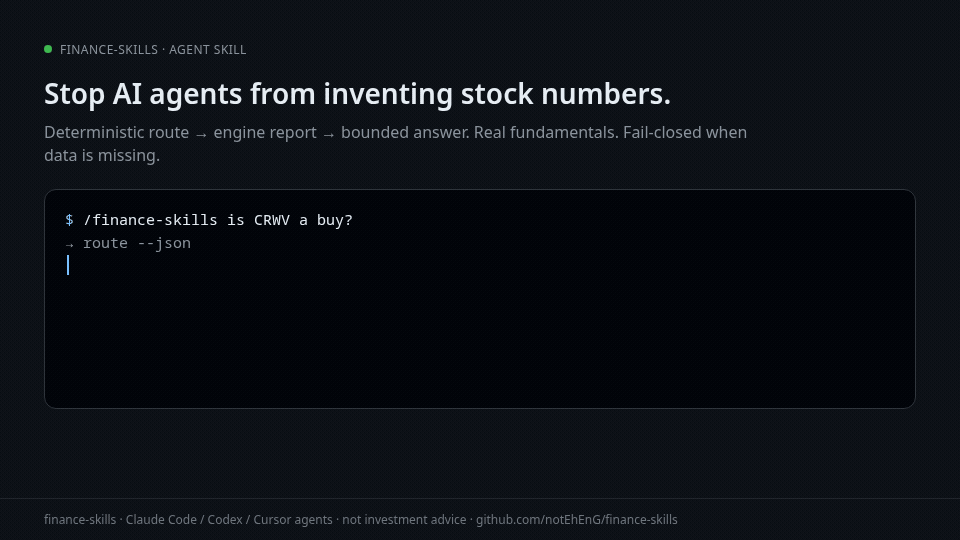

# finance-skills

[](https://github.com/notEhEnG/finance-skills/actions/workflows/ci.yml)
[](https://pypi.org/project/finance-skills/)
[](https://pypi.org/project/finance-skills/)
[](LICENSE)

**Guardrailed financial-analysis skill for AI coding agents.**

When an agent talks about a public company, it can invent plausible EV/EBITDA, fill missing net debt with zero, or say “buy.” This skill forces a **deterministic** path: route → engine report → bounded answer. Numbers come only from the report; missing data is **disabled**, not guessed.

```text
# 1) Install skill (Claude Code)
curl -fsSL https://raw.githubusercontent.com/notEhEnG/finance-skills/main/install.sh | bash -s -- claude

# 2) In the agent
/finance-skills is CRWV a buy?
```



**Who this is for:** Claude Code / Codex / Cursor-style agent users and people building tool-using agents.  
**Who this is not for:** stock tips, portfolio advice, or r/investing “what should I buy” threads.

---

## The failure mode (exact)

| Without skill | With skill |
|---------------|------------|
| Model invents FCF % or intrinsic value | Metrics from one engine report |
| Missing debt → silent zero | Fail-closed; DCF/EV disabled with reason |
| “I’d buy the dip” | Policy: analysis only, never a recommendation |
| Fixture demo treated as live tape | `data_state: fixture` + mandatory disclosure |

**Data quality:** live pulls use **yfinance** (delayed, incomplete, label-noisy). Always verify revenue, FCF, debt, cash, shares, and capex in **10-K/10-Q**. Fixtures (CRWV, NBIS) are **sample data, not live**.

---

## Agent interaction (contract)

1. **User:** “Is CRWV a buy?”  
2. **Agent runs one command:**  
   `python3 scripts/ask.py --json "Is CRWV a buy?"` (add `--fixture` for sample data)  
3. **Engine returns** `answer_draft` + full `report` (disabled DCF, fixture flag, evidence)  
4. **Agent sends `answer_draft` to the user** and **stops scripting** (`stop_tool_loop`)  
5. No buy/sell recommendation; numbers only from the draft/report  

**Hard gate:** if `ask` (or legacy `route --json` + engine `--json`) did not run this turn for an in-scope company question, **do not state financial numbers.**

**Anti-pattern:** chaining five Python scripts and dumping JSON.  
**Success:** one `ask` → user-visible analysis.

Full policy: [`SKILL.md`](SKILL.md) · templates: [`docs/agent-policy.md`](docs/agent-policy.md) · eval: [`docs/eval.md`](docs/eval.md)

---

## Install

**Skill (primary)**

```bash
curl -fsSL https://raw.githubusercontent.com/notEhEnG/finance-skills/main/install.sh | bash -s -- claude
# codex | antigravity | all
```

| Runtime | Status | Path |
|---------|--------|------|
| Claude Code | **tested** (skill dir + bash engine) | `.claude/skills/finance-skills/` |
| Codex-compatible | **best effort** | `.codex/skills/` (or `CODEX_SKILLS_DIR`) |
| Cursor-style | **best effort** (attach skill + run scripts) | project skill copy |
| MCP server | **not shipped** | — |

**CLI (secondary)**

```bash
pip install finance-skills
finance-skills brief CRWV --fixture
```

---

## Slash commands

```text
/finance-skills is NVDA overvalued?
/finance-skills is PLTR a value trap?
/finance-skills brief CRWV
/finance-skills valuation AAPL
/finance-skills compare AMD NVDA
/finance-skills learn rule40
/finance-skills help
```

| Intent | Module |
|--------|--------|
| default / quick take | `brief` |
| cheap / buy / worth / DCF | `valuation` (analysis, not a rec) |
| value trap / red flags | `redflags` |
| balance sheet / runway | `health` |
| compare / vs | `compare` |
| walkthrough | `company` |
| concept only (no ticker) | `learn` |
| personal “what should I buy/sell” | **refuse** |

```bash
python3 scripts/router.py route --json "Is CRWV a buy?"
python3 scripts/brief.py CRWV --fixture --json   # includes engine_report
```

---

## Output & fail-closed

Every core verb JSON includes **`engine_report`**:

- `source.data_state`: live | fixture | unavailable | …  
- `disabled_analyses`: reason_code + unlock  
- `response_guidance.prohibited_claims` / `mandatory_caveats`  
- calculations never encode unknown net debt as `0`

Schema: [`docs/engine-report.schema.json`](docs/engine-report.schema.json)

---

## Eval (public)

20-prompt bare-model-vs-skill table and hard-fail rules: **[`docs/eval.md`](docs/eval.md)**

```bash
python -m pytest tests/test_agent_transcripts.py tests/test_route_request.py -q
```

Transcript hard fails: invent number · say buy · hide disabled DCF · fixture-as-live.

---

## Optional CLI

Same engine outside an agent UI:

```bash
pip install finance-skills
finance-skills route --json "is NBIS a value trap?"
finance-skills brief AAPL
finance-skills compare CRWV NBIS --fixture
```

---

## Development

```bash
pip install -e ".[dev]"
pytest tests/ -q --cov=scripts
ruff check scripts tests && mypy scripts
```

Where to talk about this: agent / Claude Code / tool communities — **not** as stock advice on investing subs. See [`docs/SOCIAL.md`](docs/SOCIAL.md).

---

## License

[MIT](LICENSE) · Read-only research · **Not investment advice**
